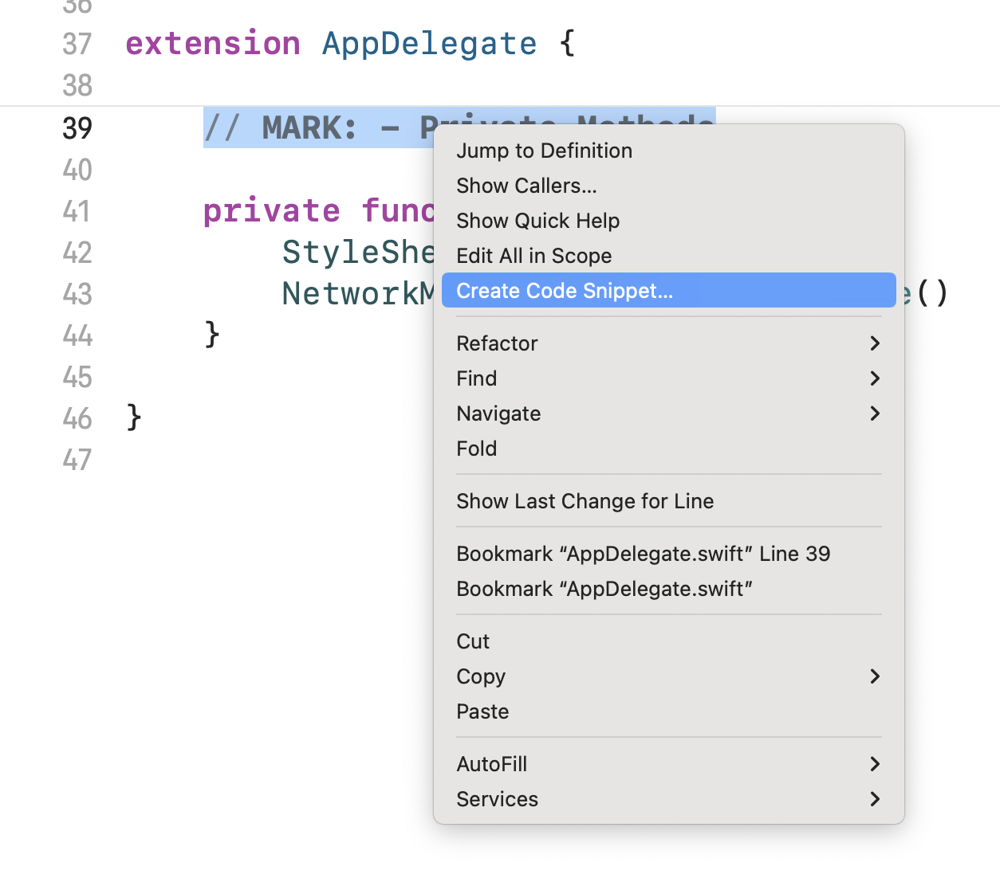
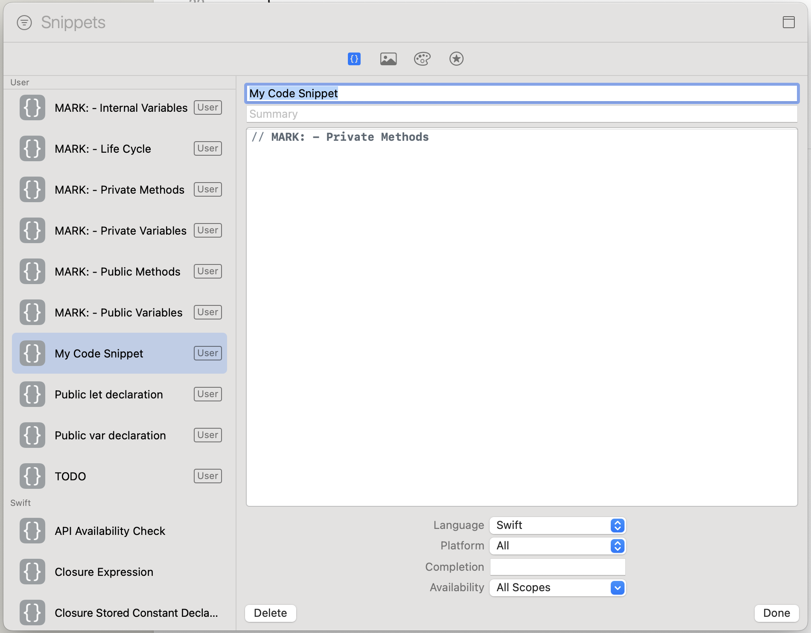

# Xcode Code Snippets
A collection of useful Xcode code snippets with exporting and importing scripts.

## Importing snippets
To import code snippets into Xcode, run the following command:

`./import.sh`

This will import all snippets from the `xcode-code-snippets/CodeSnippets` folder into `/Users/[USERNAME]/Library/Developer/Xcode/UserData/CodeSnippets` folder.

## Exporting snippets
To export the code snippets from Xcode, located in `/Users/[USERNAME]/Library/Developer/Xcode/UserData/CodeSnippets`, run the following command:

`./export.sh`

This will export all current Xcode snippets to the desired directory.

## Existing snippets

To use them, just start typing and press `ctrl + space`.

### Comments

```swift
// MARK: - Public Variables
```
Start typing `//pub...`

```swift
// MARK: - Internal Variables
```
Start typing `//int...`

```swift
// MARK: - Private Variables
```
Start typing `//pri...`


```swift
// MARK: - Life Cycle
```
Start typing `//lif...`

```swift
// MARK: - Public Methods
```
Start typing `//pub...`

```swift
// MARK: - Private Methods
```
Start typing `//pri...`

```swift
// MARK: - Internal Methods
```
Start typing `//int...`

```swift
// TODO: <your todo here...>
```
Start typing `//to...`

### Declarations

```swift
public let <name> = <value>
```
Start typing `//let...`

```swift
public var <name> = <value>
```
Start typing `//var...`

```swift
extension <ClassName> {
        
}
```
Start typing `//exte...`

## Creating your own snippets



